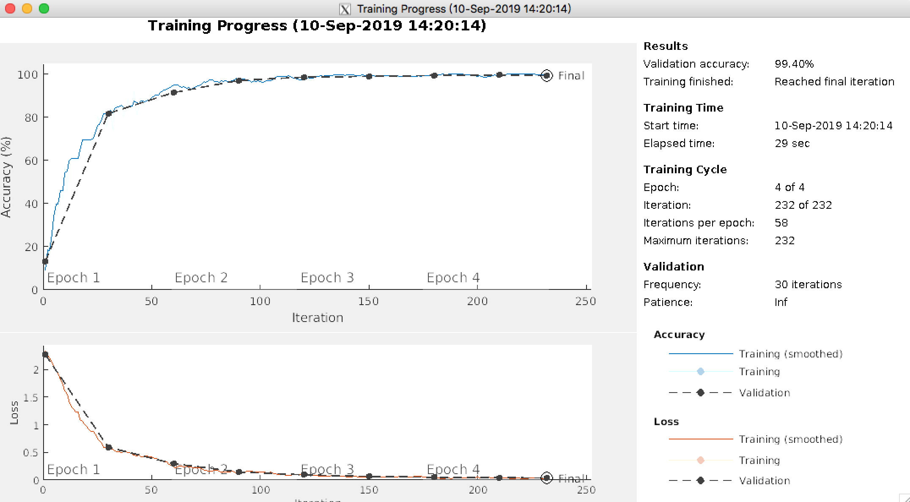

# MATLAB_DeepToolbox
matlab deeptoolbox usage

## Load and Explore Image Data
```
digitDatasetPath = fullfile(matlabroot,'toolbox','nnet','nndemos', ...
    'nndatasets','DigitDataset');
imds = imageDatastore(digitDatasetPath, ...
    'IncludeSubfolders',true,'LabelSource','foldernames');
numTrainFiles = 750;
[imdsTrain,imdsValidation] = splitEachLabel(imds,numTrainFiles,'randomize');
```

## Define Network Architecture

```
layers = [
    imageInputLayer([28 28 1])
    
    convolution2dLayer(3,8,'Padding','same')
    batchNormalizationLayer
    reluLayer
    
    maxPooling2dLayer(2,'Stride',2)
    
    convolution2dLayer(3,16,'Padding','same')
    batchNormalizationLayer
    reluLayer
    
    maxPooling2dLayer(2,'Stride',2)
    
    convolution2dLayer(3,32,'Padding','same')
    batchNormalizationLayer
    reluLayer
    
    fullyConnectedLayer(10)
    softmaxLayer
    classificationLayer];
```

## Specify Training Options

```
options = trainingOptions('sgdm', ...
    'InitialLearnRate',0.01, ...
    'MaxEpochs',4, ...
    'Shuffle','every-epoch', ...
    'ValidationData',imdsValidation, ...
    'ValidationFrequency',30, ...
    'Verbose',false, ...
    'Plots','training-progress');
```


## Train Network Using Training Data
```
net = trainNetwork(imdsTrain,layers,options);
```
<p align='center'>
 
</p>

## Classify Validation Images and Compute Accuracy
```
YPred = classify(net,imdsValidation);
YValidation = imdsValidation.Labels;

accuracy = sum(YPred == YValidation)/numel(YValidation)
```

accuracy = 0.9924

