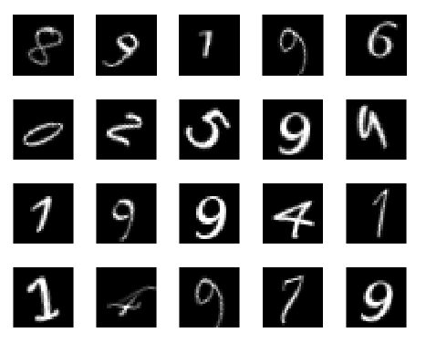

# MATLAB_DeepToolbox
Matlab deeptoolbox usage: Generally speaking, there are 5 steps to follow. This is a simple demo which shows how to classify digits. Refer to "train_digits.m" for the complete code. 
```bash
.
├── 1. Load and Explore Image Data
├── 2. Define Network Architecture
├── 3. Specify Training Options
├── 4. Train Network Using Training Data
├── 5. Classify Validation Images and Compute Accuracy
```

## 1. Load and Explore Image Data
Divide the data into training and validation data sets, so that each category in the training set contains 750 images, and the validation set contains the remaining images from each label.
```
digitDatasetPath = fullfile(matlabroot,'toolbox','nnet','nndemos', ...
    'nndatasets','DigitDataset');
imds = imageDatastore(digitDatasetPath, ...
    'IncludeSubfolders',true,'LabelSource','foldernames');
numTrainFiles = 750;
[imdsTrain,imdsValidation] = splitEachLabel(imds,numTrainFiles,'randomize');
```
Display some of the images in the datastore.
```
figure;
perm = randperm(10000,20);
for i = 1:20
    subplot(4,5,i);
    imshow(imds.Files{perm(i)});
end
```
<p align='center'>
 
</p>

## 2. Define Network Architecture

```
layers = [
    imageInputLayer([28 28 1])
    
    convolution2dLayer(3,8,'Padding','same')
    batchNormalizationLayer
    reluLayer
    
    maxPooling2dLayer(2,'Stride',2)
    
    convolution2dLayer(3,16,'Padding','same')
    batchNormalizationLayer
    reluLayer
    
    maxPooling2dLayer(2,'Stride',2)
    
    convolution2dLayer(3,32,'Padding','same')
    batchNormalizationLayer
    reluLayer
    
    fullyConnectedLayer(10)
    softmaxLayer
    classificationLayer];
```
- **Image Input Layer** An imageInputLayer is where you specify the image size, which, in this case, is 28-by-28-by-1. These numbers correspond to the height, width, and the channel size. The digit data consists of grayscale images, so the channel size (color channel) is 1. For a color image, the channel size is 3, corresponding to the RGB values. You do not need to shuffle the data because trainNetwork, by default, shuffles the data at the beginning of training. trainNetwork can also automatically shuffle the data at the beginning of every epoch during training.

- **Convolutional Layer** In the convolutional layer, the first argument is filterSize, which is the height and width of the filters the training function uses while scanning along the images. In this example, the number 3 indicates that the filter size is 3-by-3. You can specify different sizes for the height and width of the filter. The second argument is the number of filters, numFilters, which is the number of neurons that connect to the same region of the input. This parameter determines the number of feature maps. Use the 'Padding' name-value pair to add padding to the input feature map. For a convolutional layer with a default stride of 1, 'same' padding ensures that the spatial output size is the same as the input size. You can also define the stride and learning rates for this layer using name-value pair arguments of convolution2dLayer.

- **Batch Normalization Layer** Batch normalization layers normalize the activations and gradients propagating through a network, making network training an easier optimization problem. Use batch normalization layers between convolutional layers and nonlinearities, such as ReLU layers, to speed up network training and reduce the sensitivity to network initialization. Use batchNormalizationLayer to create a batch normalization layer.

- **ReLU Layer** The batch normalization layer is followed by a nonlinear activation function. The most common activation function is the rectified linear unit (ReLU). Use reluLayer to create a ReLU layer.

- **Max Pooling Layer** Convolutional layers (with activation functions) are sometimes followed by a down-sampling operation that reduces the spatial size of the feature map and removes redundant spatial information. Down-sampling makes it possible to increase the number of filters in deeper convolutional layers without increasing the required amount of computation per layer. One way of down-sampling is using a max pooling, which you create using maxPooling2dLayer. The max pooling layer returns the maximum values of rectangular regions of inputs, specified by the first argument, poolSize. In this example, the size of the rectangular region is [2,2]. The 'Stride' name-value pair argument specifies the step size that the training function takes as it scans along the input.

- **Fully Connected Layer** The convolutional and down-sampling layers are followed by one or more fully connected layers. As its name suggests, a fully connected layer is a layer in which the neurons connect to all the neurons in the preceding layer. This layer combines all the features learned by the previous layers across the image to identify the larger patterns. The last fully connected layer combines the features to classify the images. Therefore, the OutputSize parameter in the last fully connected layer is equal to the number of classes in the target data. In this example, the output size is 10, corresponding to the 10 classes. Use fullyConnectedLayer to create a fully connected layer.

- **Softmax Layer** The softmax activation function normalizes the output of the fully connected layer. The output of the softmax layer consists of positive numbers that sum to one, which can then be used as classification probabilities by the classification layer. Create a softmax layer using the softmaxLayer function after the last fully connected layer.

- **Classification Layer** The final layer is the classification layer. This layer uses the probabilities returned by the softmax activation function for each input to assign the input to one of the mutually exclusive classes and compute the loss. To create a classification layer, use classificationLayer.

## 3. Specify Training Options

```
options = trainingOptions('sgdm', ...
    'InitialLearnRate',0.01, ...
    'MaxEpochs',4, ...
    'Shuffle','every-epoch', ...
    'ValidationData',imdsValidation, ...
    'ValidationFrequency',30, ...
    'Verbose',false, ...
    'Plots','training-progress');
```
Train the network using stochastic gradient descent with momentum (SGDM) with an initial learning rate of 0.01. Set the maximum number of epochs to 4. An epoch is a full training cycle on the entire training data set. Monitor the network accuracy during training by specifying validation data and validation frequency. Shuffle the data every epoch. The software trains the network on the training data and calculates the accuracy on the validation data at regular intervals during training. 

## 4. Train Network Using Training Data
```
net = trainNetwork(imdsTrain,layers,options);
```
<p align='center'>
 
</p>

## 5. Classify Validation Images and Compute Accuracy
Accuracy is the fraction of labels that the network predicts correctly. In this case, more than 99% of the predicted labels match the true labels of the validation set.
```
YPred = classify(net,imdsValidation);
YValidation = imdsValidation.Labels;

accuracy = sum(YPred == YValidation)/numel(YValidation)
```

accuracy = 0.9924

